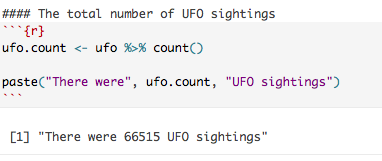
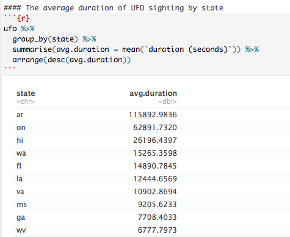
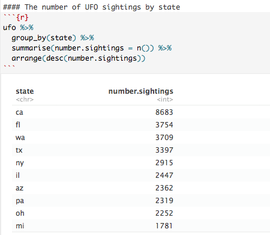
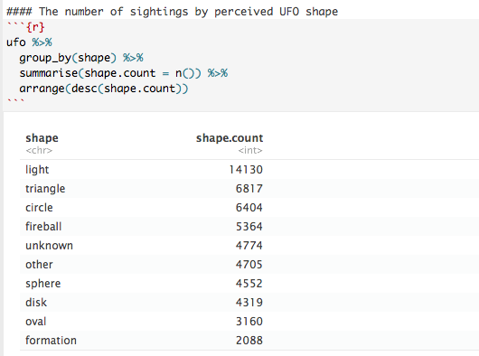
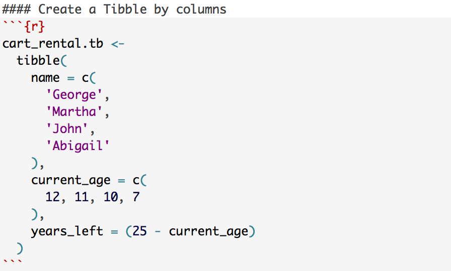
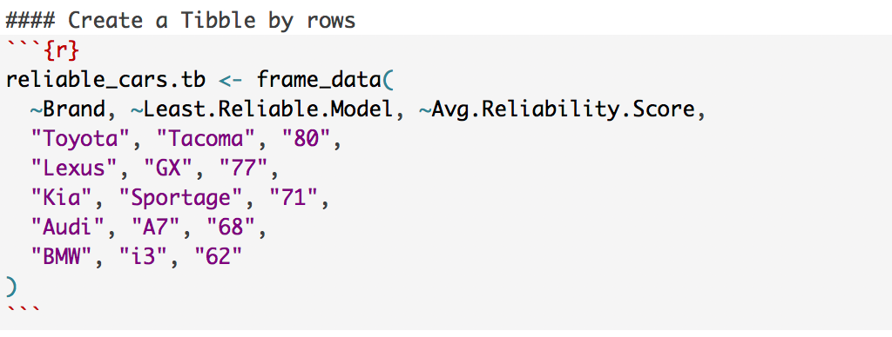
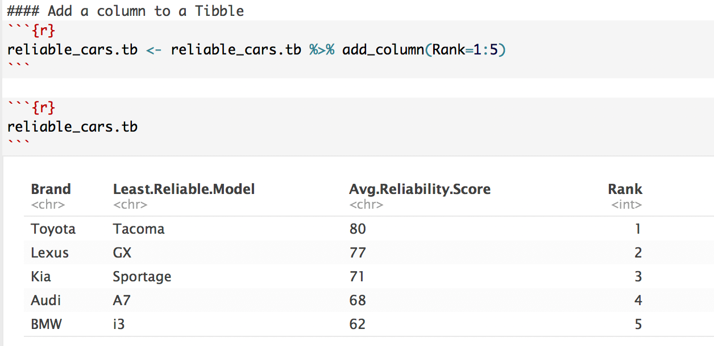
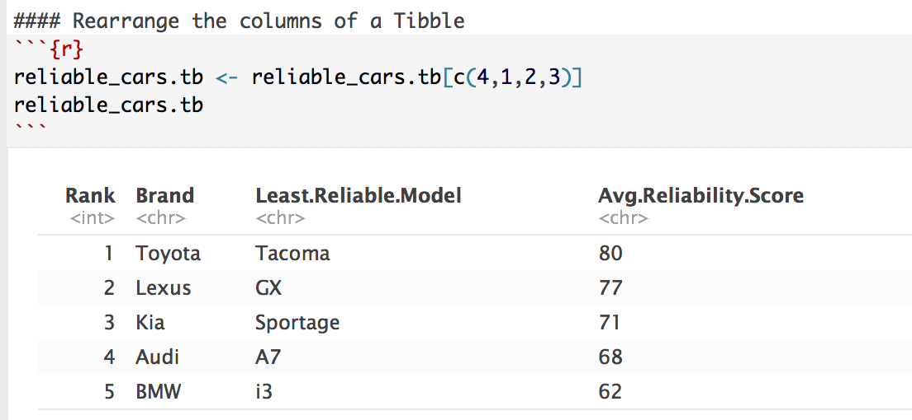
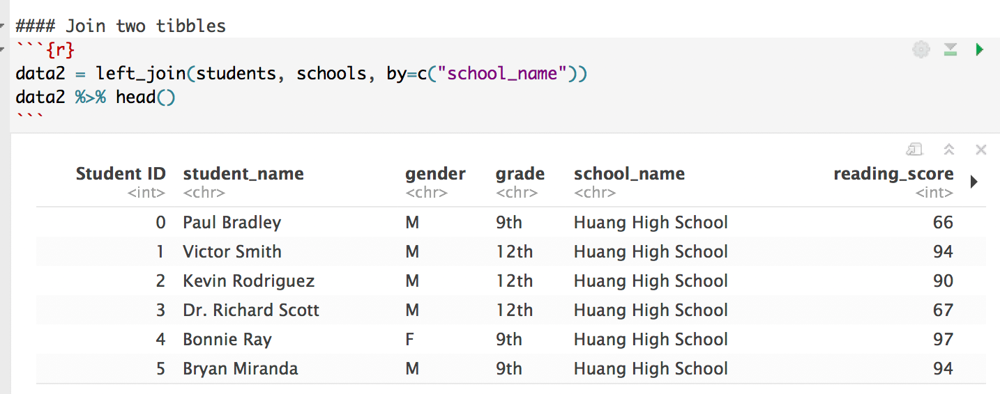
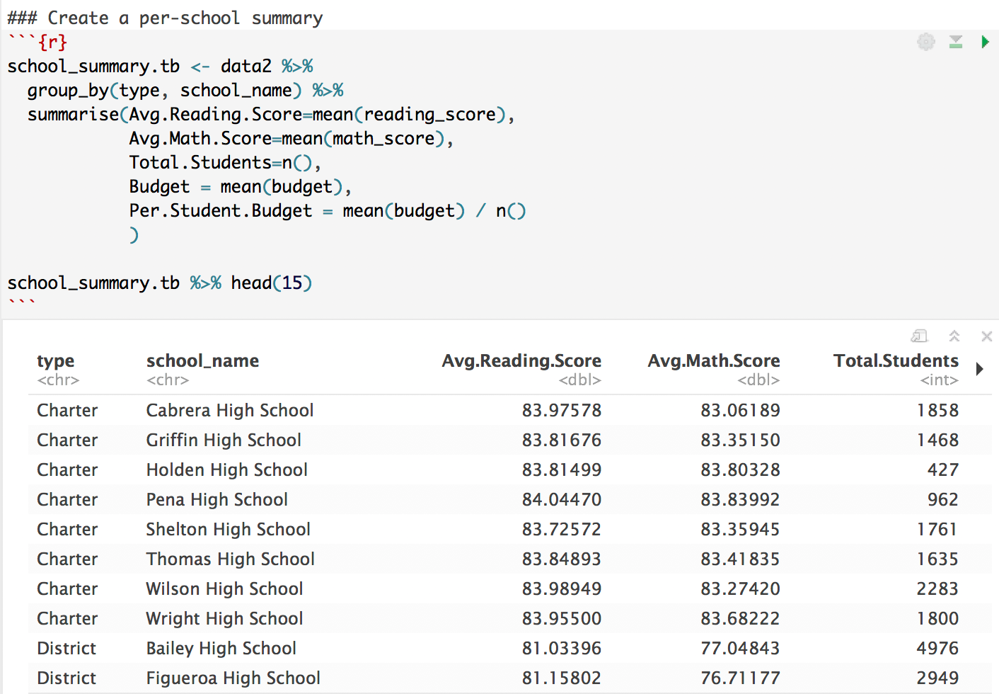

# 18.2 Tibbles R Terrific

## Overview

Today's lesson equips students with the fundamentals of loading and wrangling data in R.

### Class Objectives

* Students will be able to load data into tibbles.
* Students will be able to use the pipe operator to sequentialize operations.
* Students will be able to create tibbles.
* Students will be able to manipulate data in tibbles.

## Instructor Prep

<details>
  <summary><strong>Instructor Notes</strong></summary>

* Please reference our [Student FAQ](../../../05-Instructor-Resources/README.md#unit-18-r) for answers to questions frequently asked by students of this program. If you have any recommendations for additional questions, feel free to log an issue or a pull request with your desired additions.

</details>

<details>
  <summary><strong>Sample Class Video</strong></summary>

* To view an example class lecture visit (Note video may not reflect latest lesson plan): [Class Video](https://codingbootcamp.hosted.panopto.com/Panopto/Pages/Viewer.aspx?id=ea6d9710-003c-4a48-acb3-aa6a017dd1e2)

</details>

- - -

# Class Activities

## 1. Warmup

| Activity Time:       0:20 |  Elapsed Time:      0:20  |
|---------------------------|---------------------------|

<details>
  <summary><strong>✏️ 1.1 Students Do: Warmup (0:15)</strong></summary>

* **Files**: [Activities/01-Stu_UFO/Unsolved](Activities/01-Stu_UFO/Unsolved)

* **Readme**: [Activities/01-Stu_UFO/Unsolved/README.md](Activities/01-Stu_UFO/README.md)

* In this activity, students will work with a previously seen data set on UFO sightings.

</details>

<details>
  <summary><strong>⭐ 1.2 Review: Warmup Activity (0:05)</strong></summary>

* **Files**: [Activities/01-Stu_UFO/Solved/ufo.Rmd](Activities/01-Stu_UFO/Solved/ufo.Rmd)

* After reading in the CSV, we can use the pipe operator to obtain the total number of rows.

  

  * Optional point: `nrow()` would have returned the same results.

* To obtain the number of states, territories, and provinces, as well as a list thereof:

  

* To obtain the average duration of UFO sightings, grouped by state, we use a series of pipes.

  

  * The last line, which sorts the results in descending order, has not yet been covered, and is optional.

* The same process is performed to retrieve the number of sightings by state, and the number of sightings by shape:

  

  

</details>

<sub>[Having issues with this activity? Report a bug!](https://bit.ly/2V7Ynms)</sub>

- - -
  
## 2. Tibbles and Tibbles

| Activity Time:       0:30 |  Elapsed Time:      0:50  |
|---------------------------|---------------------------|

<details>
  <summary><strong>📣 2.1 Instructor Do: Creating a Tibble (0:10)</strong></summary>

* **Files**: [Activities/02-Ins_Tibbles/Solved/tibbles.Rmd](Activities/02-Ins_Tibbles/Solved/tibbles.Rmd)

* Point out students that one of R's great strengths is that it makes it convenient to explore and manipulate data.

* Explain that tibbles are essentially the data frames familiar from Pandas, with some additional conveniences to make them easier to view and interact with.

* Explain that the objectives for this section are to learn to:

  * Use the `tibble` function to create tibbles from _column_ vectors.

  * Use the `tribble` function to create tibbles by manually passing column names and _row_ vectors.

* Explain that the next demonstration provides an example of each these.

* Open [Activities/02-Ins_Tibbles/Solved/tibbles.Rmd](Activities/02-Ins_Tibbles/Solved/tibbles.Rmd)

* Explain that the first example demonstrates how to use the `tibble` function to create a tibble.

* Emphasize that `tibble` is useful for defining tibbles on a column-by-column basis.

* Point out that `tibble` accepts a list of _named vectors_.

* Each vector's name defines a column.

* Each element in the vector creates a row.

* Ask a student to explain the shape of the `call.centers.tb` tibble.

  * Explain that the `call.centers.tb` tibble will have `City`, `Country`, `Population`, `Square.Miles`, `Population.Density`, and `Employees.Needed` columns.

* Ask a student to explain what values the first row of this tibble will contain.

  * Explain that the first row will contain the data: `"Dhaka", "Bangladesh", 14400000, 118.3, 14400000 / 118.3, (144000000 / 118.3) / 1000`.

* Point out that the final two values are _derived_ from previous columns.

* Remind students that this is useful for for defining data on a columnar basis.

* Point out that, often, we'd prefer to define data in a row-by-row basis.

* Explain that the `tribble` function provides this functionality.

* Explain that, to use `tribble`, we first pass all of the column names; then, the data for each row.

```r
market.research.tb <- tribble(
  ~Group, ~Interest, ~Show.Interest.Types, ~Age.Range, ~Retention,
  "A", "Low", c("animated", "comedy", "drama"), "14-17", 0.12,
  "B", "High", c("action", "suspenseful", "edgy"), "18-35", 0.87,
  "C", "Medium", c("current events", "reality", "crime", "mystery"), "36-65", 0.37,
  "D", "Low", c("current events", "crime", "thriller"), "66-99", 0.01
)
```

* Point out that each column name is preceded by a tilde (`~`).

* Point out that an entry in a row can contain a vector.

  * Point out that `c("animated", "comedy", "drama")` is a _vector_, which is the first row's _single_ value for the `Show.Interest.Types` column.

* Point out that both of these methods require that we pass data to `tibble` or `tribble` either manually or programmatically.

* Point out that a lot of our data will come from _files_.

* Explain that R, like Python, provides a simple function for loading data from a file into a tibble.

```r
simple.data.tb <-
  read_tsv("simpledata.tsv")
```

* Explain that this will read the data in `simpledata.tsv` into a tibble.

  * Explain that a TSV file is the same as a CSV file, except it uses a _tab_ character instead of a comma to separate entries.

* Explain that we can also use `read.table` to load TSV files.

```r
simple.data.tb <-
  read.table("simpledata.tsv")
```

* Remind students that, in order to use relative paths to load files, they must set their working directory properly.

  * For example, if `simpledata.tsv` lives in `~/Documents`, we must run: `setwd("~/Documents")` for the above call to `read_tsv` to work.

* Explain that this covers three of the most common methods for creating tibbles in R.

* Take a moment to address remaining questions before proceeding.

</details>

<details>
  <summary><strong>✏️ 2.2 Students Do: Tibbles and Tibbles (0:15)</strong></summary>

* **Files**: [Activities/03-Stu_Tibbles_and_Tibbles/Unsolved](Activities/03-Stu_Tibbles_and_Tibbles/Unsolved)

* **Readme**: [Activities/03-Stu_Tibbles_and_Tibbles/Unsolved/README.md](Activities/03-Stu_Tibbles_and_Tibbles/README.md)

* In this activity, students will create their own Tibbles, first by columns, then by rows.

</details>

<details>
  <summary><strong>⭐ 2.3 Review: Tibbles and Tibbles (0:05)</strong></summary>

* **Files**: [Activities/03-Stu_Tibbles_and_Tibbles/Solved/tibbles_and_tibbles.Rmd](Activities/03-Stu_Tibbles_and_Tibbles/Solved/tibbles_and_tibbles.Rmd)

* The `tibble()` method is used to create a new tibble.

  

* Ask a student which columns are defined here:

  * `name`, `current_age`, and `years_left`

* The `years_left` column is calculated by subtracting the `current_age` of each row from 25.

* Next, the `tribble()` method is used to create a second Tibble, this time by rows:

  

  * The columns are first defined, and are preceded by `~`, a tilde.
  * Then each row is defined.

* The `add_row()` method adds a new row to a Tibble:

  

* Similarly, `add_column()` adds a column to an existing Tibble:

  

* Finally, the columns of a Tibble can be rearranged simply with a vector of the columns in the desired order:

  

  * Remind the class that indexing in R begins at one, not zero.

</details>

<sub>[Having issues with this activity? Report a bug!](https://bit.ly/34k1Rq2)</sub>

- - -
  
## 3. School Tibble

| Activity Time:       0:35 |  Elapsed Time:      1:25  |
|---------------------------|---------------------------|

<details>
  <summary><strong>📣 3.1 Instructor Do: Element-wise Function Application (0:10)</strong></summary>

* **Files**: [Activities/04-Ins_Apply/Solved/apply.Rmd](Activities/04-Ins_Apply/Solved/apply.Rmd)

#### Motivation

* Point out that we'll often want to transform the elements of a list on a per-element basis.

  * For example, we might want to convert a vector containing temperatures measured in Celsius to temperatures in Fahrenheit.

  * Point out that we would want to update each element in this vector individually—i.e., on an _element-wise_ basis.

```r
celsius <- c(0, -2, 0, 5.2, 5.4)
```

* Ask a student how they might convert `celsius` to a vector containing temperatures in Fahrenheit.

  * Tell students they may assume they have a function, called `toFahrenheit`, which accepts a celsius value and returns that value in Fahrenheit.

* Explain that we could achieve this using a `for` loop.

* Explain that this is a valid solution, but adds a lot of "visual noise" for such a simple task.

```r
fahrenheit <- numeric()
for (i in 1:length(celsius)) {
  temperature_fahrenheit <- toFahrenheit(celsius[i])
  fahrenheit[i] <- temperature_fahrenheit
}
```

* Point out that we'd prefer to be able to express this task more concisely.

* Explain that R's `sapply` functions allow us to do just this.

```r
fahrenheit <- sapply(celsius, toFahrenheit)
```

#### Explanation

* Explain that, when called, `sapply` will apply `toFahrenheit` to every element in `celsius`, and store the resulting vector in `fahrenheit`.

* Point out that `sapply` accepts two arguments:

  * A list or vector to apply a function to; and

  * The function to apply to each element.

* Explain that, if students need to apply a function to elements of a list/vector, but get a _list_ instead of a _vector_ as a return value, they can use `lapply` instead.

```r
fahrenheit <- lapply(celsius, toFahrenheit)
```

* Explain that students should use `lapply` when they know they specifically need a list data type. Otherwise, they should defer to `sapply`.

* Students will have a chance to practice `sapply()` in the next activity.

</details>

<details>
  <summary><strong>✏️ 3.2 Students Do: School Tibble (0:20)</strong></summary>

* **Files**: [Activities/05-School_Tibble/Unsolved](Activities/05-School_Tibble/Unsolved)

* **Readme**: [Activities/05-School_Tibble/Unsolved/README.md](Activities/05-School_Tibble/README.md)

* In this activity, students will recreate parts of the pandas homework--this time in R.

</details>

<details>
  <summary><strong>⭐ 3.3 Review: School Tibble (0:05)</strong></summary>

* **Files**: [Activities/05-School_Tibble/Solved/school_tibble.Rmd](Activities/05-School_Tibble/Solved/school_tibble.Rmd)

* In this activity, students will create two Tibbles: the first by joining two CSV files together then filtering for data. The second is assembled from scratch using the `tribble()` method.

* In creating the first Tibble, the two CSV files are first joined on the `school_name` column:

  

* A new Tibble, `school_summary.tb`, is created after a series of operations that groups the rows by `type` and `school_name`:

  

* Remind the class that despite some differences between Python and R, knowing Python and pandas made learning R considerably faster.

</details>

<sub>[Having issues with this activity? Report a bug!](https://bit.ly/2JOu3rK)</sub>

- - -

## Break

| Activity Time:       0:15 |  Elapsed Time:      2:05  |
|---------------------------|---------------------------|

- - -

## 4. Project 2 Work

| Activity Time:       0:55 |  Elapsed Time:      3:00  |
|---------------------------|---------------------------|

### Copyright

Trilogy Education Services © 2019. All Rights Reserved.
